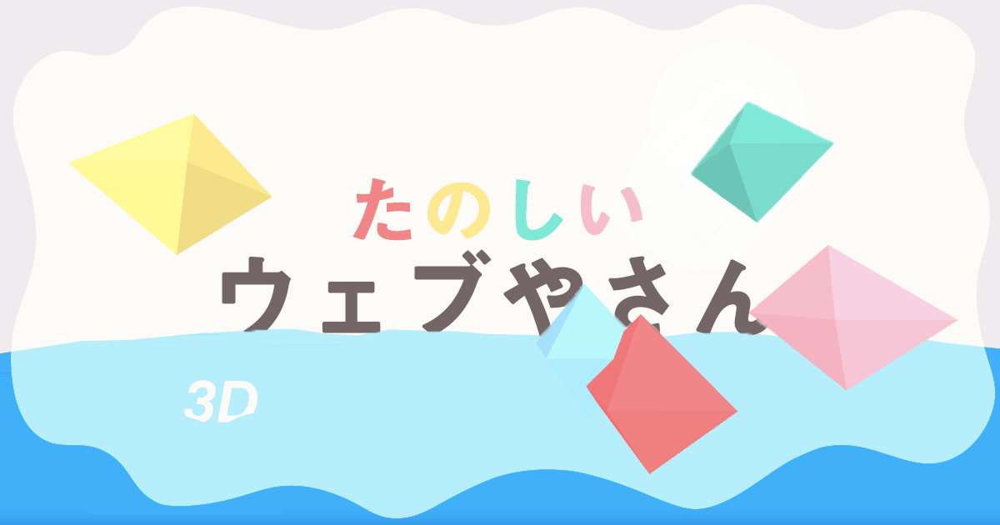

# たのしいウェブやさん3D
たのしいウェブやさん3DはwebXRのウェブページを「3Dワールド」と呼び、一味違ったウェブサイトとして制作販売をするウェブ制作サービスです。 
スマホのジャイロセンサーで360度を見回せる新しいウェブ体験を、ウェブ／XRの知識のない人にも広く楽しんでもらうことを目的としています。 
 
こちらはフレンドファンディングアプリpolcaを利用して第一弾のお客さんを募集しました。 
 
制作した3Dワールド 
[001 Ginga](https://arisaito.github.io/webya3D/worlds/001/001_index.html) 
[002 Reiwa](https://arisaito.github.io/webya3D/worlds/002/002_index.html)
